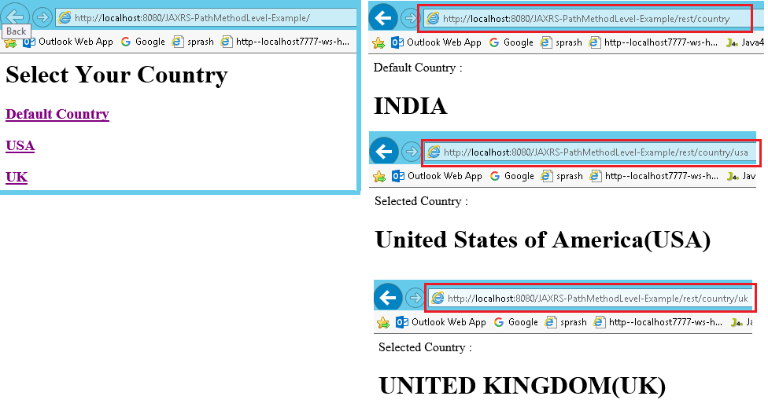

JAX-RS @Path annotation
===================================================

We can use @Path to bind URI pattern to a Java method

1.Create Dynamic web project in eclipse, convert that into Maven Project

**2. Add Jersey jar files manually / through Maven by writing repo details in
pom.xml**

```xml
<project xmlns="http://maven.apache.org/POM/4.0.0" xmlns:xsi="http://www.w3.org/2001/XMLSchema-instance" xsi:schemaLocation="http://maven.apache.org/POM/4.0.0 http://maven.apache.org/xsd/maven-4.0.0.xsd"> 
  <repositories>
 <repository>
 	<id>maven2-repository.java.net</id>
 	<name>Java.net Repository for Maven</name>
 	<url>http://download.java.net/maven/2/</url>
 	<layout>default</layout>
 </repository>
	</repositories>

	<dependencies>
 <!-- https://mvnrepository.com/artifact/com.sun.jersey/jersey-server -->
 <dependency>
 	<groupId>com.sun.jersey</groupId>
 	<artifactId>jersey-server</artifactId>
 	<version>1.19.3</version>
 </dependency>


 <!-- https://mvnrepository.com/artifact/org.glassfish.jersey.core/jersey-client -->
 <dependency>
 	<groupId>org.glassfish.jersey.core</groupId>
 	<artifactId>jersey-client</artifactId>
 	<version>2.25</version>
 </dependency>

 <!-- https://mvnrepository.com/artifact/javax.ws.rs/javax.ws.rs-api -->
 <dependency>
 	<groupId>javax.ws.rs</groupId>
 	<artifactId>javax.ws.rs-api</artifactId>
 	<version>2.0</version>
 </dependency>
	</dependencies>
</project>
```


3.Create RESTFul webservice 
```java
package service;

import javax.ws.rs.GET;
import javax.ws.rs.Path;
import javax.ws.rs.Produces;
import javax.ws.rs.core.Response;

@Path("/country")
public class PathMethodLevelService {

	@GET
	@Produces("text/html")
	public Response selectCountry() {
 String output = " Default Country : <h1>INDIA</h1>";
 return Response.status(200).entity(output).build();
	}

	@GET
	@Path("/usa")
	@Produces("text/html")
	public Response selectUSA() {
 String output = "Selected Country : <h1>United States of America(USA)</h1>";
 return Response.status(200).entity(output).build();
	}

	@GET
	@Path("/uk")
	@Produces("text/html")
	public Response selectUK() {
 String output = "Selected Country : <h1>UNITED KINGDOM(UK)</h1>";
 return Response.status(200).entity(output).build();
	}
}
```


4.Configure web.xml
```xml
<?xml version="1.0" encoding="UTF-8"?>
<web-app xmlns:xsi="http://www.w3.org/2001/XMLSchema-instance" xmlns="http://java.sun.com/xml/ns/j2ee" xmlns:web="http://xmlns.jcp.org/xml/ns/javaee" xsi:schemaLocation="http://java.sun.com/xml/ns/j2ee http://java.sun.com/xml/ns/j2ee/web-app_2_4.xsd" id="WebApp_ID" version="2.4">
  <display-name>JAXRS-PathMethodLevel-Example</display-name>
  <servlet>
    <servlet-name>jersey-serlvet</servlet-name>
    <servlet-class>com.sun.jersey.spi.container.servlet.ServletContainer</servlet-class>
    <init-param>
      <param-name>com.sun.jersey.config.property.packages</param-name>
      <param-value>service</param-value>
    </init-param>
    <load-on-startup>1</load-on-startup>
  </servlet>
  <servlet-mapping>
    <servlet-name>jersey-serlvet</servlet-name>
    <url-pattern>/rest/*</url-pattern>
  </servlet-mapping>
</web-app>
```

**5. Test Webservice directly by using URL / writing webservice client**

<http://localhost:8080/JAXRS-PathMethodLevel-Example/> **for Default country
request**

<http://localhost:8080/JAXRS-PathMethodLevel-Example/rest/country/usa> **for
usa**

<http://localhost:8080/JAXRS-PathMethodLevel-Example/rest/country/uk> **for UK**




## Response Class in JAX-RS

**javax.ws.rs.core.Response** class is reserved for an extension by a JAX-RS
implementation providers. An application should use one of the static methods to
create a Response instance using a **ResponseBuilder**. An application class
should not extend this class directly

We have following methods in Responnse classs which are used majorly

1.  public abstract int **getStatus**()

2.  public abstract
    [MultivaluedMap](http://docs.oracle.com/javaee/6/api/javax/ws/rs/core/MultivaluedMap.html)<String,Object>
    **getMetadata**()

3.  public static
    [ResponseBuilder](http://docs.oracle.com/javaee/6/api/javax/ws/rs/core/Response.ResponseBuilder.html)
    **status**(Response.StatusType status)

4.  public static
    [Response.ResponseBuilder](http://docs.oracle.com/javaee/6/api/javax/ws/rs/core/Response.ResponseBuilder.html)
    **ok**()
