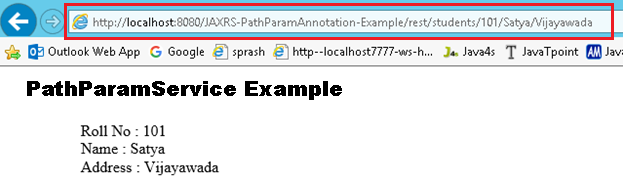

JAX-RS @PathParam annotation 
=========================================

In RESTful (JAX-RS) web services **@PathParam** annotation will be used to bind
RESTful URL parameter values with the method arguments
```html
http://localhost:8001/<Rest Service Name>/rest/customers/100/Satya
```


Here the two parameters appear in the end of the above URL [100 & Satya], which
are separated by forward slash **(/)** are called as **path parameters**

We will read those URL paramters in our webservice method using
```java
@PathParam("paramname") String variablename
```


**1. Create Dynamic web project in eclipse, convert that into Maven Project**


2.**Add RESTEasy jar files manually / through Maven by writing repo details in
pom.xml**

```xml
<project xmlns="http://maven.apache.org/POM/4.0.0" xmlns:xsi="http://www.w3.org/2001/XMLSchema-instance" xsi:schemaLocation="http://maven.apache.org/POM/4.0.0 http://maven.apache.org/xsd/maven-4.0.0.xsd">
  <modelVersion>4.0.0</modelVersion>
  <groupId>JAXRS-PathParamAnnotation-Example</groupId>
  <artifactId>JAXRS-PathParamAnnotation-Example</artifactId>
  <version>0.0.1-SNAPSHOT</version>
  <packaging>war</packaging>
  
  <repositories>
		<repository>
			<id>maven2-repository.java.net</id>
			<name>Java.net Repository for Maven</name>
			<url>http://download.java.net/maven/2/</url>
			<layout>default</layout>
		</repository>
	</repositories>

	<dependencies>
			<dependency>
			<groupId>com.sun.jersey</groupId>
			<artifactId>jersey-server</artifactId>
			<version>1.8</version>
		</dependency>		
	</dependencies>
  
  	<build>
		<finalName>JAXRS-PathParamAnnotation-Example</finalName>
		<plugins>
			<plugin>
				<artifactId>maven-compiler-plugin</artifactId>
				<configuration>
					<compilerVersion>1.5</compilerVersion>
					<source>1.5</source>
					<target>1.5</target>
				</configuration>
			</plugin>
		</plugins>
	</build>
  
</project>
```

3.Create RESTFul webservice using RESTEasy
```java
package services;

@Path("/students")
public class PathParamService {
	
	@GET
	@Path("{rollno}/{name}/{address}")
	@Produces("text/html")
	public Response getResultByPassingValue(
			@PathParam("rollno") String rollno,
					@PathParam("name") String name,
					@PathParam("address") String address) {		
		String output = "<h1>PathParamService Example</h1>";
		output = output+"<br>Roll No : "+rollno;
		output = output+"<br>Name : "+name;
		output = output+"<br>Address : "+address;		 
		return Response.status(200).entity(output).build(); 
	}
}
```

4.Configure web.xml, Register Jersey dependency class
```xml
<?xml version="1.0" encoding="UTF-8"?>
<web-app xmlns:xsi="http://www.w3.org/2001/XMLSchema-instance" xmlns="http://java.sun.com/xml/ns/j2ee" xmlns:web="http://xmlns.jcp.org/xml/ns/javaee" xsi:schemaLocation="http://java.sun.com/xml/ns/j2ee http://java.sun.com/xml/ns/j2ee/web-app_2_4.xsd" id="WebApp_ID" version="2.4">
  <display-name>JAXRS-PathParamAnnotation-Example</display-name>
  <servlet>
    <servlet-name>jersey-serlvet</servlet-name>
    <servlet-class>com.sun.jersey.spi.container.servlet.ServletContainer</servlet-class>
    <init-param>
      <param-name>com.sun.jersey.config.property.packages</param-name>
      <param-value>services</param-value>
    </init-param>
    <load-on-startup>1</load-on-startup>
  </servlet>
  <servlet-mapping>
    <servlet-name>jersey-serlvet</servlet-name>
    <url-pattern>/rest/*</url-pattern>
  </servlet-mapping>
</web-app>
```

**5. Test Webservice directly by using URL / writing webservice client**

<http://localhost:8080/JAXRS-PathParamAnnotation-Example/rest/students/101/Satya/Vijayawada>



Note : In Upcomming Examples POM.XML , Web.xml are same for all applications. So
iam skipping those. If any changes in those files I will mention don’t worry
