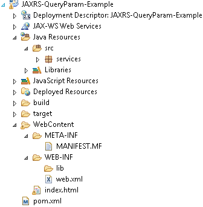
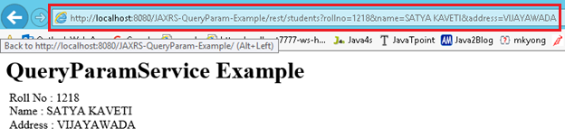

16.JAX-RS @QueryParam annotation 
==========================================

```html
http://localhost:8001/…/rest/customers?custNo=100&custName=Satya
```


If the client sends an input in the form of query string in the URL, then those
parameters are called as **Query Parameters**. If you observe the above syntax,
client passing **custNo=100&custName=Satya** started after question mark **(?)**
symbol and each parameter is separated by **&** symbol, those parameters are
called as query parameters.

### Steps to Implement this Web Service Application

**1. Create Dynamic web project in eclipse, convert that into Maven Project**



2.Add RESTEasy jar files manually / through Maven by writing repo details in
**pom.xml(skip)**

**3. Create RESTFul webservice using Jersy**
```java
package services; 

@Path("/students")
public class QueryParamService {	
	@GET
	@Produces("text/html")
	public Response getResultByPassingValue(
					@QueryParam("rollno") String rollno,
					@QueryParam("name") String name,
					@QueryParam("address") String address) {		
		String output = "<h1>QueryParamService Example</h1>";
		output = output+"<br>Roll No : "+rollno;
		output = output+"<br>Name : "+name;
		output = output+"<br>Address : "+address;		 
		return Response.status(200).entity(output).build(); 
	}
}
```

4.Configure web.xml **(SKIPING)**

5.Test Webservice directly by using URL / writing webservice client

[http://localhost:8080/JAXRS-QueryParam-Example/rest/students?rollno=1218&name=SATYA
KAVETI&address=VIJAYAWADA](http://localhost:8080/JAXRS-QueryParam-Example/rest/students?rollno=1218&name=SATYA%20KAVETI&address=VIJAYAWADA)


