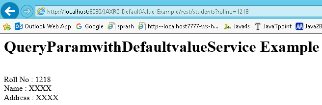

JAX-RS @DefaultValue Annotation
===================================

Sometimes URL doesn’t contain the values which are expected the methods. In that
situation we can use @DefaultValue for passing default values to method
parameters. @DefaultValue is good for optional parameter.

```java
package services;

import javax.ws.rs.DefaultValue;
import javax.ws.rs.GET;
import javax.ws.rs.Path;

@Path("/students")
public class QueryParamwithDefaultvalueService {
	@GET
	@Produces("text/html")
	public Response getResultByPassingValue(@DefaultValue("1000") @QueryParam("rollno") String rollno,
			@DefaultValue("XXXX") @QueryParam("name") String name,
			@DefaultValue("XXXX") @QueryParam("address") String address) {
		String output = "<h1>QueryParamwithDefaultvalueService Example</h1>";
		output = output + "<br>Roll No : " + rollno;
		output = output + "<br>Name : " + name;
		output = output + "<br>Address : " + address;
		return Response.status(200).entity(output).build();
	}
}
```


<http://localhost:8080/JAXRS-DefaultValue-Example/rest/students?rollno=1218>

**in Above URL we are not passing Name, Address paramaeter values. So it will
take Default values passed in** @DefaultValue("XXXX") annotation


