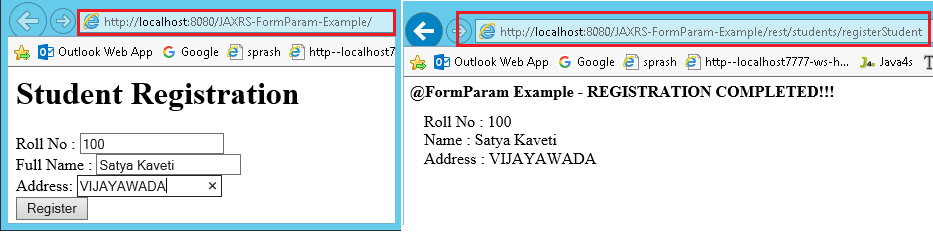

JAX-RS @FormParam annotation
========================================

If we have a HTML form having two input fields and submit button. Lets client
enter those details and submit to the RESTful web service. Then the rest service
will extract those details by using this **@FormParam** annotation.we can
use @FormParam annotation to bind HTML form parameters value to a Java method

### Steps to Implement this Web Service Application

1.Create Dynamic web project in eclipse, convert that into Maven Project


2.Configure **pom.xml, web.xml (Skipping)**

**3.Create RESTFul webservice Jersey**
```java
package services; 
import javax.ws.rs.FormParam; 
import javax.ws.rs.POST;
import javax.ws.rs.Path;
import javax.ws.rs.Produces;
import javax.ws.rs.core.Response;
 
@Path("/students")
public class FormParamService {
	
	@POST
	@Path("/registerStudent")
	@Produces("text/html")
	public Response getResultByPassingValue(
			@FormParam("rollno") String rollno,
			@FormParam("name") String name,
			@FormParam("address") String address) {
		
		String output = "<h1>@FormParam Example - REGISTRATION COMPLETED!!!</h1>";
		output = output+"<br>Roll No : "+rollno;
		output = output+"<br>Name : "+name;
		output = output+"<br>Address : "+address;		 
		return Response.status(200).entity(output).build();
	}
}
```

**5. Test Webservice directly by using URL / writing webservice client**

1.  <http://localhost:8080/JAXRS-FormParam-Example/>

2.  <http://localhost:8080/JAXRS-FormParam-Example/rest/students/registerStudent>


