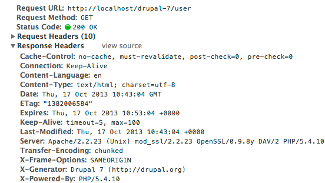
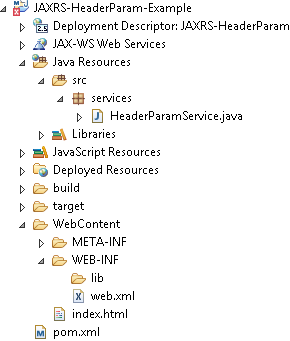
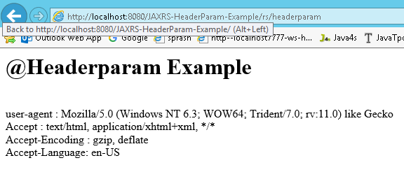

JAX-RS @HeaderParam Example 
================================

We can get the HTTP header details using JAXRS. HTTP headers like below formate



 

We have two ways to get HTTP request header in JAX-RS :

1. Inject directly with @HeaderParam

2. Pragmatically via @Context

## JAX-RS @HeaderParam Example

1.Create Dynamic web project in eclipse, convert that into Maven Project



2.Configure **pom.xml, web.xml (Skipping)**

3.Create RESTFul webservice
```java
package services;

import javax.ws.rs.GET;
import javax.ws.rs.HeaderParam;
import javax.ws.rs.Path;
import javax.ws.rs.core.Response;

@Path("/rs")
public class HeaderParamService {

	@GET
	@Path("/headerparam")
	public Response getHeader(
 	@HeaderParam("user-agent") String userAgent,
 	@HeaderParam("Accept") String accept,
            @HeaderParam("Accept-Encoding") String encoding,
            @HeaderParam("Accept-Language") String lang) {
 
 String output = "<h1>@Headerparam Example</h1>";
 output = output+"<br>user-agent : "+userAgent;
 output = output+"<br>Accept : "+accept;
 output = output+"<br>Accept-Encoding : "+encoding;
 output = output+"<br>Accept-Language: "+lang;

 return Response.status(200)
 	.entity(output)
 	.build();

	}

}
```

5.Test Webservice directly by using URL / writing webservice client

<http://localhost:8080/JAXRS-HeaderParam-Example/rs/headerparam>


