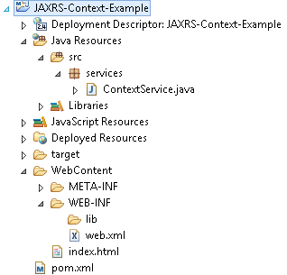
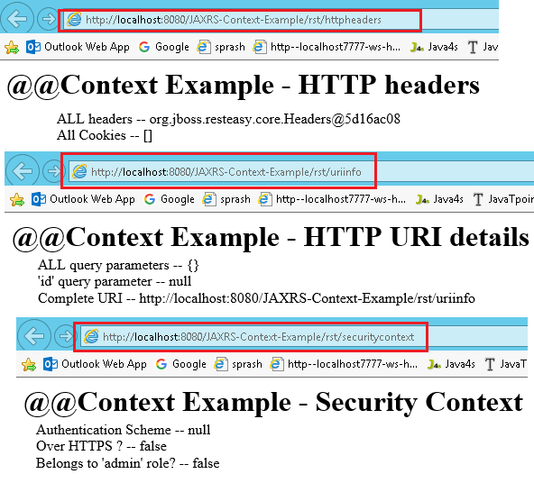

JAX-RS @Context Example 
============================

JAX-RS provides the **@Context** annotation to inject a variety of resources in
your RESTful services. Some of the most commonly injected components are HTTP
headers, HTTP URI related information

-   *HTTP headers*

-   *HTTP URI details*

-   *Security Context*

-   *Resource Context*

-   *Request*

-   *Configuration*

-   *Application*

-   *Providers*


## JAX-RS @Context Example

1.Create Dynamic web project in eclipse, convert that into Maven Project



2.Configure **pom.xml, web.xml (Skipping)**

3.Create RESTFul webservice
```java
package services;

import javax.ws.rs.GET;
 
import javax.ws.rs.Path;
import javax.ws.rs.core.Context;
import javax.ws.rs.core.HttpHeaders;
import javax.ws.rs.core.Response;
import javax.ws.rs.core.SecurityContext;
import javax.ws.rs.core.UriInfo;

@Path("/rst")
public class ContextService {

	@GET
    @Path("httpheaders")
	public Response getHttpheaders(@Context HttpHeaders headers){        
 String output = "<h1>@@Context Example - HTTP headers</h1>";
  output =  output+"<br>ALL headers -- "+ headers.getRequestHeaders().toString();        
  output =  output+"<br>All Cookies -- "+ headers.getCookies().values();
  return Response.status(200)
  	.entity(output)
  	.build();
    }
	
	
	@GET
	  @Path("uriinfo")
	  public Response test(@Context UriInfo uriDetails){
 String output = "<h1>@@Context Example - HTTP URI details</h1>";
	output =  output+"<br>ALL query parameters -- "+ uriDetails.getQueryParameters().toString();
	output =  output+"<br>'id' query parameter -- "+ uriDetails.getQueryParameters().get("id");
	output =  output+"<br>Complete URI -- "+ uriDetails.getRequestUri();
  return Response.status(200)
  	.entity(output)
  	.build();
	  }
	
	@GET
	  @Path("securitycontext")
	  public Response test(@Context SecurityContext secContext){
 String output = "<h1>@@Context Example - Security Context</h1>";
 //output =  output+"<br>Caller -- "+ secContext.getUserPrincipal().getName();
 output =  output+"<br>Authentication Scheme -- "+ secContext.getAuthenticationScheme();
 output =  output+"<br>Over HTTPS ? -- "+ secContext.isSecure();
 output =  output+"<br>Belongs to 'admin' role? -- "+ secContext.isUserInRole("admin");
	      return Response.status(200)
  	.entity(output)
  	.build();
	  }
	
	
}
```

5.Test Webservice directly by using URL / writing webservice client

- <http://localhost:8080/JAXRS-Context-Example/rst/httpheaders>

- <http://localhost:8080/JAXRS-Context-Example/rst/uriinfo>

- <http://localhost:8080/JAXRS-Context-Example/rst/securitycontext>


