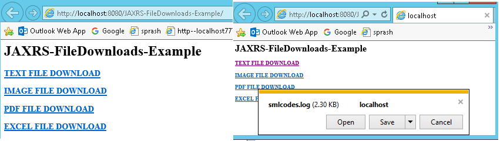

JAX-RS Download files Example
================================

We can download any type of files from the RESTful web services, **@produces**
annotation

We should annotate our method with

-   **@Produces(“text/plain“)** If you are expecting Text file as response

-   **@Produces(“image/your image type[.jpg/.png/.gif]")** for downloading any
    Image files

-   **@Produces(“application/pdf“)** for downloading PDF files

<br>


### Steps to Implement this Web Service Application

1.Create **Dynamic web project in eclipse**, **pom.xml, web.xml (Skipping)**

2.Create RESTFul webservice Jersey

```java
package service;
import java.io.File;
import javax.ws.rs*;

@Path("/download")
public class FileDownloadService {
	private static final String TEXT_FILE_PATH = "C:\\Users\\kaveti_s\\textfile.txt";
	private static final String IMG_FILE_PATH = "C:\\Users\\kaveti_s\\img.jpg";
	private static final String PDF_FILE_PATH = "C:\\Users\\kaveti_s\\pdffile.pdf";
	private static final String XLS_FILE_PATH = "C:\\Users\\kaveti_s\\excel.xlsx";
	
	//TEXTFILE DOWNLOAD
	@GET
	@Path("/textfile")
	@Produces("text/plain")
	public Response downloadTextFile() {
		File file = new File(TEXT_FILE_PATH);
		ResponseBuilder response = Response.ok((Object) file);
		response.header("Content-Disposition",
			"attachment; filename=\"smlcodes.log\"");
		return response.build();
	}
	
	//IMAGE DOWNLOAD
	@GET
	@Path("/image")
	@Produces("image/jpg")
	public Response downloadImage() {
		File file = new File(IMG_FILE_PATH);
		ResponseBuilder response = Response.ok((Object) file);
		response.header("Content-Disposition",
			"attachment; filename=smlcodes.jpg");
		return response.build();
	}

	//PDF DOWNLOAD
	@GET
	@Path("/pdf")
	@Produces("application/pdf")
	public Response downloadPDF() {
		File file = new File(PDF_FILE_PATH);
		ResponseBuilder response = Response.ok((Object) file);
		response.header("Content-Disposition",
				"attachment; filename=smlcodes.pdf");
		return response.build();
	}

	
	//XLS DOWNLOAD
	@GET
	@Path("/xls")
	@Produces("application/vnd.ms-excel")
	public Response downloadXLS() {
		File file = new File(XLS_FILE_PATH);
		ResponseBuilder response = Response.ok((Object) file);
		response.header("Content-Disposition",
			"attachment; filename=new-smlcodes.xls");
		return response.build();

	}
}
```

```html
//index.html
<h1>JAXRS-FileDownloads-Example</h1>
 
<h3><a href="download/textfile">TEXT FILE DOWNLOAD</a></h3>
 <h3><a href="download/image">IMAGE FILE DOWNLOAD</a></h3>
 <h3><a href="download/pdf">PDF FILE DOWNLOAD</a></h3>
 <h3><a href="download/xls">EXCEL FILE DOWNLOAD</a></h3>
```

5.Test Webservice directly by using URL / writing webservice client

<http://localhost:8080/JAXRS-FileDownloads-Example/>


