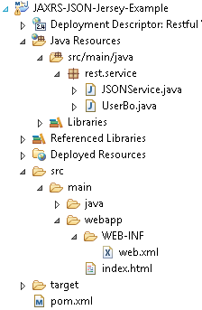
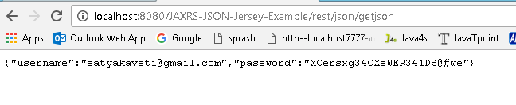

JAX-RS JSON Example Using Jersey
===================================

Jersey uses Jackson to convert **object to / form JSON**. In this example, we
show you how to convert a “user" object into JSON format, and return it back to
user

Steps to Implement this Web Service Application

**1. Create Dynamic web project in eclipse, convert that into Maven Project**



**2. Configure pom.xml**

To make Jersey support JSON mapping, declares “jersey-json.jar" in
Maven pom.xml file.
```xml
<project xmlns="http://maven.apache.org/POM/4.0.0" xmlns:xsi="http://www.w3.org/2001/XMLSchema-instance" xsi:schemaLocation="http://maven.apache.org/POM/4.0.0 http://maven.apache.org/xsd/maven-4.0.0.xsd">
  <modelVersion>4.0.0</modelVersion>
  <groupId>JAX-RS-JSON_Example-Jersey</groupId>
  <artifactId>JAX-RS-JSON_Example-Jersey</artifactId>
  <version>0.0.1-SNAPSHOT</version>
  <packaging>war</packaging>
  <build>
    <sourceDirectory>src</sourceDirectory>
    <plugins>
      <plugin>
        <artifactId>maven-compiler-plugin</artifactId>
        <version>3.5.1</version>
        <configuration>
          <source>1.8</source>
          <target>1.8</target>
        </configuration>
      </plugin>
      <plugin>
        <artifactId>maven-war-plugin</artifactId>
        <version>3.0.0</version>
        <configuration>
          <warSourceDirectory>WebContent</warSourceDirectory>
        </configuration>
      </plugin>
    </plugins>
  </build>
  
  <repositories>
		<repository>
			<id>maven2-repository.java.net</id>
			<name>Java.net Repository for Maven</name>
			<url>http://download.java.net/maven/2/</url>
			<layout>default</layout>
		</repository>
	</repositories>

	<dependencies>
	

		<dependency>
			<groupId>com.sun.jersey</groupId>
			<artifactId>jersey-server</artifactId>
			<version>1.8</version>
		</dependency>

		<dependency>
			<groupId>com.sun.jersey</groupId>
			<artifactId>jersey-json</artifactId>
			<version>1.8</version>
		</dependency>

	</dependencies>
</project>
```

3.Configure **web.xml**

In web.xml, declares `“com.sun.jersey.api.json.POJOMappingFeature"` as
`“init-param"` in Jersey mapped servlet. It will make Jersey support JSON/object
mapping.
```xml
<web-app id="WebApp_ID" version="2.4"
	xmlns="http://java.sun.com/xml/ns/j2ee" xmlns:xsi="http://www.w3.org/2001/XMLSchema-instance"
	xsi:schemaLocation="http://java.sun.com/xml/ns/j2ee 
	http://java.sun.com/xml/ns/j2ee/web-app_2_4.xsd">
	<display-name>Restful Web Application</display-name>

	<servlet>
		<servlet-name>jersey-serlvet</servlet-name>
		<servlet-class>com.sun.jersey.spi.container.servlet.ServletContainer</servlet-class>
		<init-param>
			<param-name>com.sun.jersey.config.property.packages</param-name>
			<param-value>rest.service</param-value>
		</init-param>
		<init-param>
			<param-name>com.sun.jersey.api.json.POJOMappingFeature</param-name>
			<param-value>true</param-value>
		</init-param>
		<load-on-startup>1</load-on-startup>
	</servlet>

	<servlet-mapping>
		<servlet-name>jersey-serlvet</servlet-name>
		<url-pattern>/rest/*</url-pattern>
	</servlet-mapping>

</web-app>
```

**4. Write “UserBo" class**

Write “UserBo" class object, Jersey will convert this object into JSON format.
```java
package services;

public class UserBo {
	String username;
	String password;

	public String getUsername() {
		return username;
	}

	public void setUsername(String username) {
		this.username = username;
	}

	public String getPassword() {
		return password;
	}

	public void setPassword(String password) {
		this.password = password;
	}

	@Override
	public String toString() {
		// TODO Auto-generated method stub
		return "User [username=" + username + ", password=" + password + "]";
	};
}
```

**5. Create RESTFul webservice Jersey**  
Annotate the method with @Produces(MediaType.APPLICATION_JSON). Jersey will use
Jackson to handle the JSON conversion automatically.
```java
package rest.service;

@Path("/json")
public class JSONService {
	@GET
	@Path("/getjson")
	@Produces(MediaType.APPLICATION_JSON)
	public UserBo getboInJSON() {

		UserBo bo = new UserBo();
		bo.setUsername("satyakaveti@gmail.com");
		bo.setPassword("XCersxg34CXeWER341DS@#we");
		return bo;
	}

}
```

**6. Test Webservice directly by using URL / writing webservice client**

<http://localhost:8080/JAX-RS-JSON_Example-Jersey/json/getjson>


