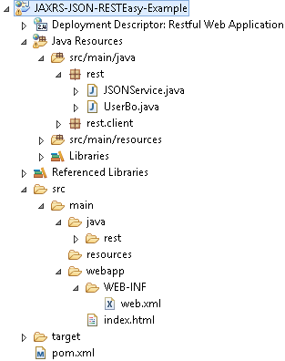
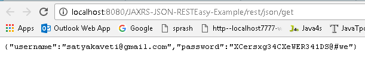

JAX-RS JSON Example Using RESTEasy
=====================================

To integrate Jackson with RESTEasy, you just need to include
**“resteasy-jackson-provider.jar“.**

**1. Create Dynamic web project in eclipse, convert that into Maven Project**



**2. Configure pom.xml**
```xml
<project xmlns="http://maven.apache.org/POM/4.0.0" xmlns:xsi="http://www.w3.org/2001/XMLSchema-instance"
	xsi:schemaLocation="http://maven.apache.org/POM/4.0.0 http://maven.apache.org/maven-v4_0_0.xsd">
	<modelVersion>4.0.0</modelVersion>
	<groupId>JAXRS-JSON-RESTEasy-Example</groupId>
	<artifactId>JAXRS-JSON-RESTEasy-Example</artifactId>
	<packaging>war</packaging>
	<version>1.0-SNAPSHOT</version>
	<name>JAXRS-JSON-RESTEasy-Example</name>
	<url>http://maven.apache.org</url>

	<repositories>
 <repository>
 	<id>JBoss repository</id>
 	<url>https://repository.jboss.org/nexus/content/groups/public-jboss/</url>
 </repository>
	</repositories>

	<dependencies>
 <dependency>
 	<groupId>junit</groupId>
 	<artifactId>junit</artifactId>
 	<version>4.8.2</version>
 	<scope>test</scope>
 </dependency>

 <dependency>
 	<groupId>org.jboss.resteasy</groupId>
 	<artifactId>resteasy-jaxrs</artifactId>
 	<version>2.2.1.GA</version>
 </dependency> 

 <dependency>
 	<groupId>org.jboss.resteasy</groupId>
 	<artifactId>resteasy-jackson-provider</artifactId>
 	<version>2.2.1.GA</version>
 </dependency>

	</dependencies>

	<build>
 <finalName>JAXRS-JSON-RESTEasy-Example</finalName>
 <plugins>
 	<plugin>
  <artifactId>maven-compiler-plugin</artifactId>
  <configuration>
  	<source>1.6</source>
  	<target>1.6</target>
  </configuration>
 	</plugin>
 </plugins>
	</build>

</project>
```


**3. Configure web.xml**  
In web.xml Disable RESTEasy auto scanning and register your REST service
manually, otherwise, you will get *Illegal to inject a message body into a
singleton into public.JacksonJsonProvider Error*
```xml
<web-app>
	<display-name>JAXRS-JSON-RESTEasy-Example</display-name>
	<context-param>
 <param-name>resteasy.resources</param-name>
 <param-value>rest.JSONService</param-value>
	</context-param>

	<listener>
 <listener-class>
 	org.jboss.resteasy.plugins.server.servlet.ResteasyBootstrap
 </listener-class>
	</listener>
	<servlet>
 <servlet-name>resteasy-servlet</servlet-name>
 <servlet-class>
 	org.jboss.resteasy.plugins.server.servlet.HttpServletDispatcher
 </servlet-class>
	</servlet>

	<servlet-mapping>
 <servlet-name>resteasy-servlet</servlet-name>
 <url-pattern>/rest/*</url-pattern>
	</servlet-mapping>

</web-app>
```


**4. Write “UserBo" class**  
Write “UserBo" class object, Jersey will convert this object into JSON format.
```java
package rest;

public class UserBo {

	String username;
	String password;

	public String getUsername() {
 return username;
	}

	public void setUsername(String username) {
 this.username = username;
	}

	public String getPassword() {
 return password;
	}

	public void setPassword(String password) {
 this.password = password;
	}

	@Override
	public String toString() {
 return "USER [username=" + username + ", password=" + password + "]";
	}

}
```


**5. Create RESTFul webservice**
```java
package rest;

import javax.ws.rs.Consumes;
import javax.ws.rs.GET;
import javax.ws.rs.POST;
import javax.ws.rs.Path;
import javax.ws.rs.Produces;
import javax.ws.rs.core.Response;


@Path("/rest/json")
public class JSONService {

	@GET
	@Path("/get")
	@Produces("application/json")
	public UserBo getUserBoInJSON() {

 UserBo bo = new UserBo();
 bo.setUsername("satyakaveti@gmail.com");
 bo.setPassword("XCersxg34CXeWER341DS@#we");
 
 return bo; 

	}

	@POST
	@Path("/post")
	@Consumes("application/json")
	public Response createUserBoInJSON(UserBo UserBo) {

 String result = "UserBo created : " + UserBo;
 return Response.status(201).entity(result).build();
 
	}
	
}
```


**6. Test Webservice directly by using URL / writing webservice client**

<http://localhost:8080/JAXRS-JSON-RESTEasy-Example/rest/json/get>


