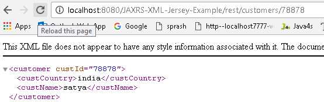

JAX-RS XML Example Using Jersey
==================================

JAX-RS supports conversion of java objects into XML with the help of JAXB. As
Jersey it self contains JAXB libraries we no need to worry about JAXB-Jersey
integration. Just include **“jersey-server.jar"**

Steps to Implement this Web Service Application

**1. Create Dynamic web project in eclipse, convert that into Maven Project**

2.Configure **pom.xml**
```xml
<project xmlns="http://maven.apache.org/POM/4.0.0" xmlns:xsi="http://www.w3.org/2001/XMLSchema-instance" xsi:schemaLocation="http://maven.apache.org/POM/4.0.0 http://maven.apache.org/xsd/maven-4.0.0.xsd">
  <modelVersion>4.0.0</modelVersion>
  <groupId>JAXRS-XML-Jersey-Example</groupId>
  <artifactId>JAXRS-XML-Jersey-Example</artifactId>
  <version>0.0.1-SNAPSHOT</version>
  <packaging>war</packaging>
  
  <repositories>
 <repository>
 	<id>maven2-repository.java.net</id>
 	<name>Java.net Repository for Maven</name>
 	<url>http://download.java.net/maven/2/</url>
 	<layout>default</layout>
 </repository>
	</repositories>

	<dependencies>
 <dependency>
 	<groupId>junit</groupId>
 	<artifactId>junit</artifactId>
 	<version>4.8.2</version>
 	<scope>test</scope>
 </dependency>

 <dependency>
 	<groupId>com.sun.jersey</groupId>
 	<artifactId>jersey-server</artifactId>
 	<version>1.8</version>
 </dependency>
 
	</dependencies>
  
  	<build>
 <finalName>JAXRS-XML-Jersey-Example</finalName>
 <plugins>
 	<plugin>
  <artifactId>maven-compiler-plugin</artifactId>
  <configuration>
  	<compilerVersion>1.5</compilerVersion>
  	<source>1.5</source>
  	<target>1.5</target>
  </configuration>
 	</plugin>
 </plugins>
	</build>
  
</project>
```


3.Configure **web.xml**
```xml
<?xml version="1.0" encoding="UTF-8"?>
<web-app>
  <display-name>RestPathAnnotationExample</display-name>
  <servlet>
    <servlet-name>jersey-serlvet</servlet-name>
    <servlet-class>com.sun.jersey.spi.container.servlet.ServletContainer</servlet-class>
    <init-param>
      <param-name>com.sun.jersey.config.property.packages</param-name>
      <param-value>rest.service</param-value>
    </init-param>
    <load-on-startup>1</load-on-startup>
  </servlet>
  <servlet-mapping>
    <servlet-name>jersey-serlvet</servlet-name>
    <url-pattern>/rest/*</url-pattern>
  </servlet-mapping>
</web-app>
```


**4. write Customer POJO class**

Write **Customer POJO class &** Annotate object with JAXB annotation, for
conversion later.
```java
package rest.service;

import javax.xml.bind.annotation.XmlAttribute;
import javax.xml.bind.annotation.XmlElement;
import javax.xml.bind.annotation.XmlRootElement;
 
@XmlRootElement(name = "customer")
public class Customer {
 
	String custName;
	String custCountry;
	int custId;

	@XmlElement
	public String getCustName() {
 return custName;
	}
	public void setCustName(String custName) {
 this.custName = custName;
	}
	
	@XmlElement	
	public String getCustCountry() {
 return custCountry;
	}
	public void setCustCountry(String custCountry) {
 this.custCountry = custCountry;
	}
	
	@XmlAttribute
	public int getCustId() {
 return custId;
	}
	public void setCustId(int custId) {
 this.custId = custId;
	}
}
```


**5. Create RESTFul webservice Jersey**

To return a XML file, annotate the method
with @Produces(MediaType.APPLICATION_XML). Jersey will convert the JAXB
annotated object into XML file automatically.
```java
package rest.service;

import javax.ws.rs.GET;
import javax.ws.rs.Path;
import javax.ws.rs.PathParam;
import javax.ws.rs.Produces;
import javax.ws.rs.core.MediaType;

@Path("/customers")
public class RestfulXMLExample {

	@GET
	@Path("/{id}")
	@Produces(MediaType.APPLICATION_XML)
	public Customer getCustomerDetails(@PathParam("id") int custId) {

 // WRITE DATABASE LOGIC TO RETRIEVE THE CUSTOMER RECORD WITH 'custID'

 Customer cust = new Customer();
 cust.setCustName("satya");
 cust.setCustCountry("india");
 cust.setCustId(custId);
 return cust;
	}
}
```


**6. Test Webservice directly by using URL / writing webservice client**

<http://localhost:8080/JAXRS-XML-Jersey-Example/rest/customers/78878>


