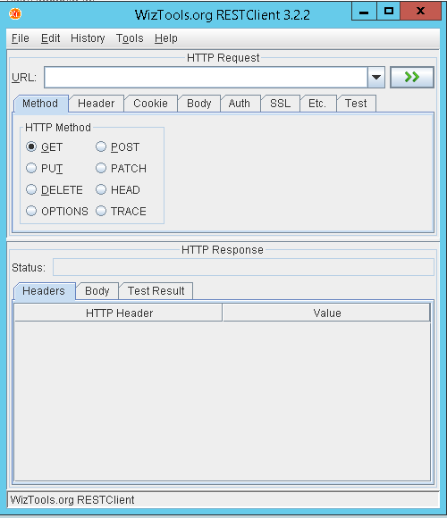
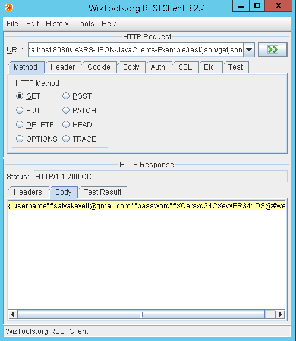
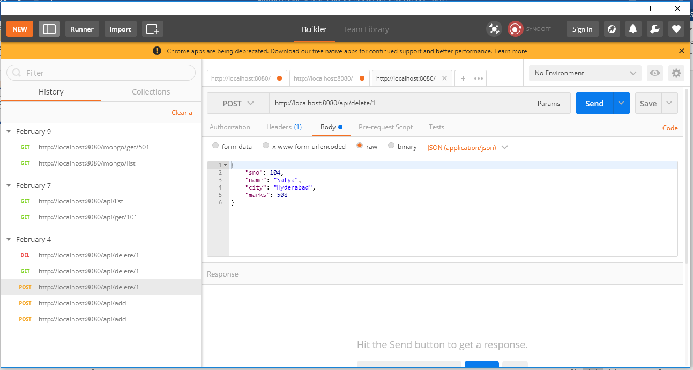
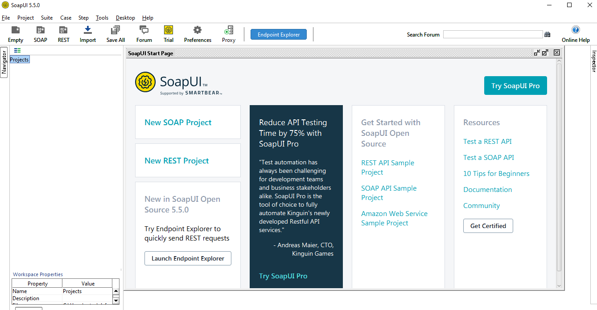

How to Test (JAX-RS) RESTful Web Services
============================================

in real time projects we will use different tools to test RESTful web services

**1.Browser Addons**

-   Postman [ Chrome Extension ]

-   REST Client [ Chrome Extension ]

-   Advanced REST Client [ Chrome Extension ]

-   Rest Client [ Firefox Add-On ]

**2.JAX-RS Local System Tools**

-   [RESTClient UI](https://code.google.com/archive/p/rest-client/downloads)

-   [SoupUi](https://www.soapui.org/)

 

### RESTClient UI

1.Download .jar file from here
<https://code.google.com/archive/p/rest-client/downloads>

2.Run jar by giving >**java -jar
restclient-ui-3.2.2-jar-with-dependencies.jar**

3.It will Opens the window as follows

4.Test Your application by proving any running web service URL

Ex: <http://localhost:8080/JAXRS-JSON-JavaClients-Example/rest/json/getjson>

### Postman

Similarly we can work with SoapUI also

