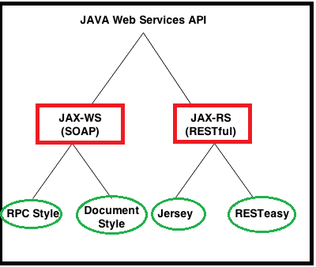

Java Web Services API
=======================

There are two main API's defined by Java for developing web service applications
since JavaEE 6.

1.  **JAX-WS:** for SOAP web services. The **are 2 ways to write JAX-WS**
    application code: by
    1.  *RPC style*
    2.  *Document style.*

2.  **JAX-RS:** for RESTful web services. There are **mainly 2 implementations**
    currently in use for creating **JAX-RS** application:
    1.  *Jersey*
    2.  *RESTeasy*.

We have some other RESTFul webservices providers like

-   *Jersey*

-   *RestEasy*

-   *Restlet*

-   *CFX*

-   *Spring Rest webservices*
