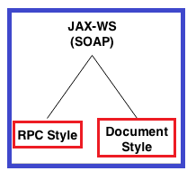

JAX-WS (SOAP web services)
=============================

SOAP stands for Simple Object Access Protocol. It is a XML-based protocol for
accessing web services.

SOAP is a W3C recommendation for communication between two applications.

SOAP is XML based protocol. It is platform independent and language independent.
By using SOAP, you will be able to interact with other programming language
applications.

**Advantages of Soap Web Services**

-   **WS Security**: SOAP defines its own security known as WS Security.

-   **Language and Platform independent**: SOAP web services can be written in
    any programming language and executed in any platform

There are two ways to develop JAX-WS example.

1.  **RPC style**

2.  **Document style**



There are two encoding use models that are used to translate a WSDL binding to a
SOAP message. They are: **literal, and encoded.**

The combination of the different style and use models give us four different
ways to translate a WSDL binding to a SOAP message.
```powershell
Document/literal
Document/encoded

RPC/literal
RPC/encoded
```


**When using a literal use model**, the body contents should conform to a
user-defined **XML-schema (XSD) structure**. The advantage is two-fold. For one,
you can validate the message body with the user-defined XML-schema, moreover,
you can also transform the message using a transformation language like XSLT.

**With a (SOAP) encoded use model**, the message has to use XSD datatypes, but
the structure of the message need not conform to any user-defined XML schema.
This makes it difficult to validate the message body or use XSLT based
transformations on the message body.
