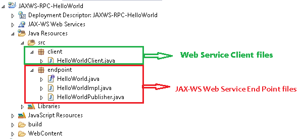
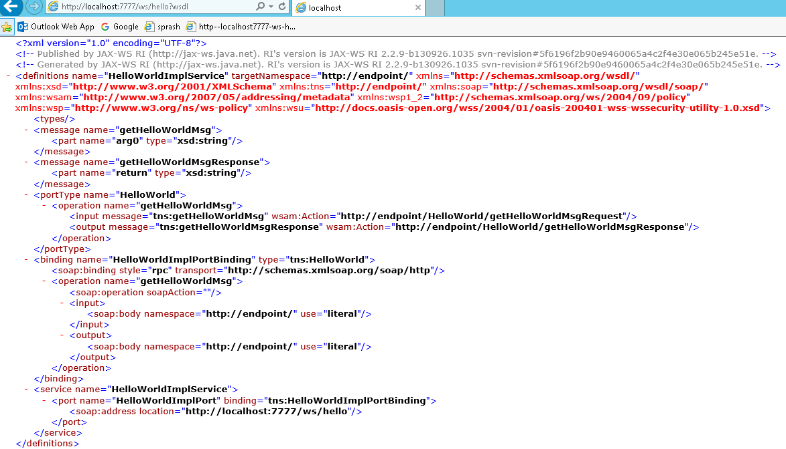
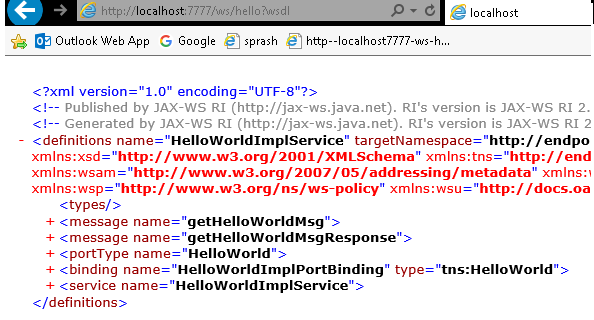
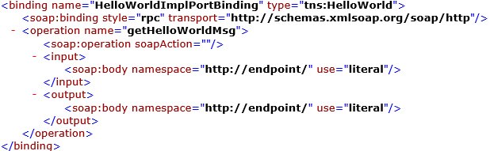
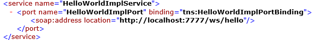

JAX-WS RPC Style
===================

1.  RPC style web services use **method name and parameters to generate XML
    structure**.

2.  The generated **WSDL is difficult to be validated against schema**.

3.  In RPC style, **SOAP message is sent as many elements**.

4.  RPC **style message is tightly coupled.**

5.  In RPC style, **SOAP message keeps the operation name**.

6.  In RPC style, **parameters are sent as discrete values**.


## Steps to create JAX-WS RPC Style Example

**1. JAX-WS Web Service End Point files**

   1. Create a Web Service Endpoint Interface with **@SOAPBinding(style = Style.RPC)**

   2. Create a Web Service Endpoint Implementation

   3. Create an Endpoint Publisher

   4. Test generated WSDL. Ex: **http://localhost:8080/ws/hello?wsdl**

**2. Web Service Client files**

<u>Java Web Service Client</u>

-   In general words, “web service endpoint" is a service which published
    outside for user to access;

-   where “web service client" is the party who access the published service.

## Example : Hello World using JAX-WS RPC Style



**1. JAX-WS Web Service End Point files**
```java
*************************************************
1. Create a Web Service Endpoint Interface
*************************************************
package endpoint;
import javax.jws.WebMethod;  
import javax.jws.WebService;  
import javax.jws.soap.SOAPBinding;  
import javax.jws.soap.SOAPBinding.Style;  
//Service Endpoint Interface  
@WebService  
@SOAPBinding(style = Style.RPC)  
public interface HelloWorld{  
 @WebMethod 
 String getHelloWorldMsg(String msg);  
}  


*************************************************
2. Create a Web Service Endpoint Implementation
*************************************************
package endpoint;
import javax.jws.WebService;  
//Service Implementation  
@WebService(endpointInterface = "endpoint.HelloWorld")  
public class HelloWorldImpl implements HelloWorld{
	@Override
	public String getHelloWorldMsg(String msg) {
 // TODO Auto-generated method stub
 return "Your Message from WebService is : "+msg;
	}     
}  


********************************************
3. Create an Endpoint Publisher
********************************************
package endpoint;
import javax.xml.ws.Endpoint;  
//Endpoint publisher  
public class HelloWorldPublisher{  
    public static void main(String[] args) {  
       Endpoint.publish("http://localhost:7777/ws/hello", new HelloWorldImpl());  
       System.out.println("WSDL Published !!");
        }  
}
```

**4. Test generated WSDL**

Run HelloWorldPublisher as Java Application & access url:
<http://localhost:7777/ws/hello?wsdl>



<http://endpoint/>" uses package name of Service endpoint publisher

the main components of WSDL documents are as below.



### WSDL Explanation

1.first Message part contains service method name & parameter list
```xml
<message name="getHelloWorldMsg">
    <part name="arg0" type="xsd:string"/>
</message>
```


2.Second Meaage part contains autogenerated Response method & return type
```xml
<message name="getHelloWorldMsgResponse">
    <part name="return" type="xsd:string"/>
</message>
```


3.PortType information is about ServiceEndpoint interface & input,output action urls
```xml
<portType name="HelloWorld">
<operation name="getHelloWorldMsg">
<input message="tns:getHelloWorldMsg" wsam:Action="http://endpoint/HelloWorld/getHelloWorldMsgRequest"/>
<output message="tns:getHelloWorldMsgResponse" wsam:Action="http://endpoint/HelloWorld/getHelloWorldMsgResponse"/>
</operation>
</portType>
```

Here <http://endpoint> **it will take package name as automatically if we won’t
provide anything**

4.Binding will generate automatically by taking RPC Style/ Document Style



5.Service tag contains service details & WSDL document location




**2. Web Service Client file**

Follow below steps to write Webservice client

1.  Create **URL** object by passing WSDL document location
    ```java
    URL url = new URL("http://localhost:7777/ws/hello?wsdl");
    ```


2.  Create **QName** by passing service URI, Service name as arguments
    ```java
    QName qname = new QName("http://endpoint/", "HelloWorldImplService");
    ```


3.  Create Service Object by **calling create (-,-)** by passing URL,QName as
    arguments. Service objects provide the client view of a Web service. ports
    available on a service can be enumerated using the getPorts method
    ```java
    Service service  = Service.create(url, qname);  
    HelloWorld hello = service.getPort(HelloWorld.class);
    ```


```java
package client;
import java.net.URL;  
import javax.xml.namespace.QName;  
import javax.xml.ws.Service;

import endpoint.HelloWorld;  
public class HelloWorldClient{  
    public static void main(String[] args) throws Exception {  
    URL url = new URL("http://localhost:7777/ws/hello?wsdl");  
   
        //1st argument service URI, refer to wsdl document above  
        //2nd argument is service name, refer to wsdl document above  
        QName qname = new QName("http://endpoint/", "HelloWorldImplService");  
       Service service = Service.create(url, qname);  
       HelloWorld hello = service.getPort(HelloWorld.class);  
       System.out.println(hello.getHelloWorldMsg("Hello, from Client"));  
    }  
}
```

By running Clinet application we will get output as below


