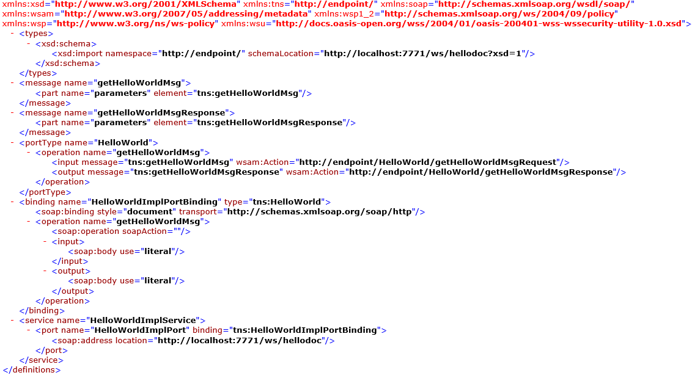
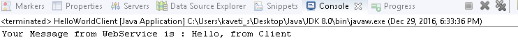

JAX-WS -Document Style
========================

1.  **SOAP Body can be structurted in any way you like**

2.  Document style web services can be **validated against predefined schema**.

3.  In document style, **SOAP message is sent as a single document**.

4.  Document **style message is loosely coupled**.

5.  In Document style, SOAP message loses the operation name.

6.  In Document style, parameters are sent in XML format.

In JAX-WS development, convert from “*RPC style*" to “*Document style*" is very
easy, just change the @SOAPBinding style option

## Example

**1. JAX-WS Web Service End Point files**
```java
*************************************************
1. Create a Web Service Endpoint Interface with
@SOAPBinding(style = Style.Document)  
*************************************************
package endpoint;

import javax.jws.WebMethod;  
import javax.jws.WebService;  
import javax.jws.soap.SOAPBinding;  
import javax.jws.soap.SOAPBinding.Style;  
//Service Endpoint Interface  
@WebService  
@SOAPBinding(style = Style.DOCUMENT)  
public interface HelloWorld{  
 @WebMethod 
 String getHelloWorldMsg(String msg);  
}  


*************************************************
2. Create a Web Service Endpoint Implementation
*************************************************
package endpoint;

import javax.jws.WebService;  
//Service Implementation  
@WebService(endpointInterface = "endpoint.HelloWorld")  
public class HelloWorldImpl implements HelloWorld{
	@Override
	public String getHelloWorldMsg(String msg) {
		// TODO Auto-generated method stub
		return "Your Message from WebService is : "+msg;
	}     
}  


*************************************************
3. Create an Endpoint Publisher & Run as Java Application
*************************************************
package endpoint;

import javax.xml.ws.Endpoint;  
//Endpoint publisher  
public class HelloWorldPublisher{  
    public static void main(String[] args) {  
       Endpoint.publish("http://localhost:7771/ws/hellodoc", new HelloWorldImpl());  
       System.out.println("WSDL Published !!");
        }  
}
```

4.Test generated WSDL. 
Ex: http://localhost:7771/ws/hellodoc?wsdl



**2. Web Service Client files**

Create Java Web Service Client & Run as Java Application
```java
package client;

import java.net.URL;  
import javax.xml.namespace.QName;  
import javax.xml.ws.Service;

import endpoint.HelloWorld;  
public class HelloWorldClient{  
    public static void main(String[] args) throws Exception {  
    URL url = new URL("http://localhost:7771/ws/hellodoc?wsdl");  
   
        //1st argument service URI, refer to wsdl document above  
        //2nd argument is service name, refer to wsdl document above  
        QName qname = new QName("http://endpoint/", "HelloWorldImplService");  
       Service service = Service.create(url, qname);  
       HelloWorld hello = service.getPort(HelloWorld.class);  
       System.out.println(hello.getHelloWorldMsg("Hello, from Client"));  
    }  
}
```



