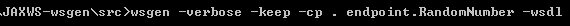

JAX-WS Tools
===============

So far we created WebService applications manually. We have some tools to
generate web service classes. let  s start understanding them

## wsimport tool(WSDL import Generate Java Files)

The **wsimport** tool is used to **parse an existing Web Services Description
Language (WSDL)** file and generate required files (JAX-WS portable artifacts &
JAX-WS Web Service End Point files).

We have to write web service client to access the published web services. This
wsimport tool is available in the
**$JDK/bin(C:\\Users\\kaveti_s\\Desktop\\Java\\JDK 8.0\\bin\\wsimport.exe)**
folder. We no need add these tools to PATH, because they are built in tools

In this example we are using JAXWS-Doc-HelloWorld published WSDL to generate
JAX-WS portable artifacts. The WSDL URL is

To generate JAX-WS portable artifacts using wsimport tool follow below steps

1. Create an Empty Project & create endpoint package for saving generated
artifacts


2. **Open command promt go to project location run wsimport with wsdl doc
location as below**

   `wsimport wsdl-location-path -d -keep`

-   **wsdl-location-path** : Is the location of wsdl file existence.

-   **-d** : specify the directory where all the generated classes should be
    placed.

-   **-keep** : It will keep the java source code of generated classes in the
    respective directory mentioned.

   `>wsimport -keep http://localhost:7777/ws/hello?wsdl`


By running this it is generated Service Endpoint files as below


```java
*************************************************
// HelloWorld.java
*************************************************
package endpoint;

import javax.jws.WebMethod;
import javax.jws.WebParam;
import javax.jws.WebResult;
import javax.jws.WebService;
import javax.jws.soap.SOAPBinding;
import javax.xml.ws.Action;

/**
 * This class was generated by the JAX-WS RI. JAX-WS RI 2.2.9-b130926.1035 Generated source version: 2.2*/
@WebService(name = "HelloWorld", targetNamespace = "http://endpoint/")
@SOAPBinding(style = SOAPBinding.Style.RPC)
public interface HelloWorld {

	/**
	 * @param arg0
	 * @return returns java.lang.String
	 */
	@WebMethod
	@WebResult(partName = "return")
	@Action(input = "http://endpoint/HelloWorld/getHelloWorldMsgRequest", output = "http://endpoint/HelloWorld/getHelloWorldMsgResponse")
	public String getHelloWorldMsg(@WebParam(name = "arg0", partName = "arg0") String arg0);

}

*************************************************
//HelloWorldImplService.java
*************************************************
package endpoint;
import java.net.MalformedURLException;
import java.net.URL;
import javax.xml.*;
@WebServiceClient(name = "HelloWorldImplService", targetNamespace = "http://endpoint/", wsdlLocation = "http://localhost:7777/ws/hello?wsdl")
public class HelloWorldImplService extends Service {

	private final static URL HELLOWORLDIMPLSERVICE_WSDL_LOCATION;
	private final static WebServiceException HELLOWORLDIMPLSERVICE_EXCEPTION;
	private final static QName HELLOWORLDIMPLSERVICE_QNAME = new QName("http://endpoint/", "HelloWorldImplService");

	static {
 URL url = null;
 WebServiceException e = null;
 try {
 	url = new URL("http://localhost:7777/ws/hello?wsdl");
 } catch (MalformedURLException ex) {
 	e = new WebServiceException(ex);
 }
 HELLOWORLDIMPLSERVICE_WSDL_LOCATION = url;
 HELLOWORLDIMPLSERVICE_EXCEPTION = e;
	}

	public HelloWorldImplService() {
 super(__getWsdlLocation(), HELLOWORLDIMPLSERVICE_QNAME);
	}

	public HelloWorldImplService(WebServiceFeature... features) {
 super(__getWsdlLocation(), HELLOWORLDIMPLSERVICE_QNAME, features);
	}

	public HelloWorldImplService(URL wsdlLocation) {
 super(wsdlLocation, HELLOWORLDIMPLSERVICE_QNAME);
	}

	public HelloWorldImplService(URL wsdlLocation, WebServiceFeature... features) {
 super(wsdlLocation, HELLOWORLDIMPLSERVICE_QNAME, features);
	}

	public HelloWorldImplService(URL wsdlLocation, QName serviceName) {
 super(wsdlLocation, serviceName);
	}

	public HelloWorldImplService(URL wsdlLocation, QName serviceName, WebServiceFeature... features) {
 super(wsdlLocation, serviceName, features);
	}

	/**	 
	 * @return returns HelloWorld
	 */
	@WebEndpoint(name = "HelloWorldImplPort")
	public HelloWorld getHelloWorldImplPort() {
	   return super.getPort(new QName("http://endpoint/", "HelloWorldImplPort"), HelloWorld.class);
	}
  
	@WebEndpoint(name = "HelloWorldImplPort")
	public HelloWorld getHelloWorldImplPort(WebServiceFeature... features) {
	   return super.getPort(new QName("http://endpoint/", "HelloWorldImplPort"), HelloWorld.class, features);
	}

	private static URL __getWsdlLocation() {
 if (HELLOWORLDIMPLSERVICE_EXCEPTION != null) {
 	throw HELLOWORLDIMPLSERVICE_EXCEPTION;
 }
 return HELLOWORLDIMPLSERVICE_WSDL_LOCATION;
	}

}
```

Now, create a Java web service client which depends on the above generated files
```java
package client;

import endpoint.HelloWorld;
import endpoint.HelloWorldImplService;

public class WSImportClinet {
public static void main(String[] args) {
	HelloWorldImplService service = new HelloWorldImplService();
	HelloWorld helloWorld = service.getHelloWorldImplPort();
	String output =helloWorld.getHelloWorldMsg("Iam WSIMPORT Message");
	System.out.println(output);	}
}
```


Run this application we will get following Output


## wsgen tool(WSDL Generator - Read Java Files Generate WSDL)

The wsgen tool is used to parse an existing web service implementation class and
generates required files (JAX-WS portable artifacts) for web service deployment.
This wsgen tool is available in $JDK/bin folder.

2 common use cases for wsgen tool:

1.  *Generates JAX-WS portable artifacts (Java files) for web service
    deployment.*

2.  *Generates WSDL and xsd files*

3.  *Create web service client for testing*

We need to create web service implementation class, remaing files will be
generated by wsgen tool
```java
package endpoint;
import javax.jws.WebMethod;
import javax.jws.WebService;

@WebService
public class RandomNumber {
	@WebMethod
	public String getRandomNumber() {
 return "Random Number Is : " + Math.random();
	}
}
```


1.Generates JAX-WS portable artifacts (Java files) for web service deployment.

To generate all the JAX-WS portable artifacts for above web service
implementation class (RandomNumber.java), use following command by going src
folder from command prompt

**>wsgen -verbose -keep -cp . endpoint.RandomNumber**


It will generate 2 .java files & 2 .class files


```java
*************************************************
// GetRandomNumber.java
*************************************************
package endpoint.jaxws;

import javax.xml.bind.annotation.XmlAccessType;
import javax.xml.bind.annotation.XmlAccessorType;
import javax.xml.bind.annotation.XmlRootElement;
import javax.xml.bind.annotation.XmlType;

@XmlRootElement(name = "getRandomNumber", namespace = "http://endpoint/")
@XmlAccessorType(XmlAccessType.FIELD)
@XmlType(name = "getRandomNumber", namespace = "http://endpoint/")
public class GetRandomNumber {


}


*************************************************
// GetRandomNumberResponse.java
*************************************************
package endpoint.jaxws;

import javax.xml.bind.annotation.XmlAccessType;
import javax.xml.bind.annotation.XmlAccessorType;
import javax.xml.bind.annotation.XmlElement;
import javax.xml.bind.annotation.XmlRootElement;
import javax.xml.bind.annotation.XmlType;

@XmlRootElement(name = "getRandomNumberResponse", namespace = "http://endpoint/")
@XmlAccessorType(XmlAccessType.FIELD)
@XmlType(name = "getRandomNumberResponse", namespace = "http://endpoint/")
public class GetRandomNumberResponse {

	@XmlElement(name = "return", namespace = "")
	private String _return;

	/**
	 * 
	 * @return returns String
	 */
	public String getReturn() {
 return this._return;
	}

	/**
	 * 
	 * @param _return
	 *            the value for the _return property
	 */
	public void setReturn(String _return) {
 this._return = _return;
	}

}
```

**2.Genarates WSDL and xsd**

To generate WSDL and xsd files for above web service implementation class
(RandomNumber.java), add an extra **-wsdl** in the wsgen command



In this case it will generate 6 files (**2 java +2 class + 1 WSDL + 1
schema.xsd**). Files under src/ folder are


```xml
*************************************************
RandomNumberService_schema1.xsd
*************************************************
<?xml version="1.0" encoding="UTF-8" standalone="yes"?>
<xs:schema version="1.0" targetNamespace="http://endpoint/" xmlns:tns="http://endpoint/" xmlns:xs="http://www.w3.org/2001/XMLSchema">

  <xs:element name="getRandomNumber" type="tns:getRandomNumber"/>
  <xs:element name="getRandomNumberResponse" type="tns:getRandomNumberResponse"/>
  <xs:complexType name="getRandomNumber">
    <xs:sequence/>
  </xs:complexType>
  <xs:complexType name="getRandomNumberResponse">
    <xs:sequence>
      <xs:element name="return" type="xs:string" minOccurs="0"/>
    </xs:sequence>
  </xs:complexType>
</xs:schema>

*************************************************
RandomNumberService.wsdl
*************************************************
<?xml version="1.0" encoding="UTF-8" standalone="yes"?>
<definitions targetNamespace="http://endpoint/" name="RandomNumberService" xmlns="http://schemas.xmlsoap.org/wsdl/" xmlns:wsp="http://www.w3.org/ns/ws-policy" xmlns:wsp1_2="http://schemas.xmlsoap.org/ws/2004/09/policy" xmlns:tns="http://endpoint/" xmlns:xsd="http://www.w3.org/2001/XMLSchema" xmlns:soap="http://schemas.xmlsoap.org/wsdl/soap/" xmlns:wsam="http://www.w3.org/2007/05/addressing/metadata">
  <types>
    <xsd:schema>
      <xsd:import namespace="http://endpoint/" schemaLocation="RandomNumberService_schema1.xsd"/>
    </xsd:schema>
  </types>
  <message name="getRandomNumber">
    <part name="parameters" element="tns:getRandomNumber"/>
  </message>
  <message name="getRandomNumberResponse">
    <part name="parameters" element="tns:getRandomNumberResponse"/>
  </message>
  <portType name="RandomNumber">
    <operation name="getRandomNumber">
      <input wsam:Action="http://endpoint/RandomNumber/getRandomNumberRequest" message="tns:getRandomNumber"/>
      <output wsam:Action="http://endpoint/RandomNumber/getRandomNumberResponse" message="tns:getRandomNumberResponse"/>
    </operation>
  </portType>
  <binding name="RandomNumberPortBinding" type="tns:RandomNumber">
    <soap:binding transport="http://schemas.xmlsoap.org/soap/http" style="document"/>
    <operation name="getRandomNumber">
      <soap:operation soapAction=""/>
      <input>
        <soap:body use="literal"/>
      </input>
      <output>
        <soap:body use="literal"/>
      </output>
    </operation>
  </binding>
  <service name="RandomNumberService">
    <port name="RandomNumberPort" binding="tns:RandomNumberPortBinding">
      <soap:address location="REPLACE_WITH_ACTUAL_URL"/>
    </port>
  </service>
</definitions>
```

<br>

All files are ready.we have to write Publisher class to publish the WSDL
document
```java
package endpoint;
import javax.xml.ws.Endpoint;
public class RandomNumberPublisher {
	public static void main(String[] args) {
 Endpoint.publish("http://localhost:8888/ws/wsgen", new RandomNumber());
 System.out.println("Service is published!");
	}
}
```

Run as Java Application. It will shows output as **Service is published!**

<http://localhost:8888/ws/wsgen?wsdl> **it is as same as generated WSDL
document**


### Finally Note these

- `Wsimport` Uses the WSDL, generates java code for the service/client
implementation.

- `Wsgen` Uses compiled code, generates WSDL (and artifacts)
